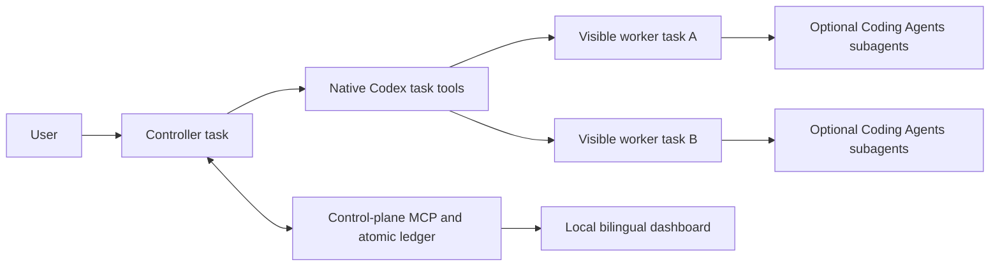

# Codex Thread Orchestration

[English](#english) · [日本語](#日本語)

Codex Thread Orchestration is a Codex plugin for coordinating multiple **user-visible Codex tasks** from one controller. Native Codex tools own task creation, worktrees, messaging, waiting, handoff, and sidebar state; the plugin adds a durable control ledger, validated call intents, task state, controller decisions, and a bilingual dashboard.

It can also start each visible worker with a `coding-agents` contract, so every isolated task or worktree can run its own bounded Coding Agents workflow without confusing those internal subagents with sibling top-level tasks.

## Article / 解説記事

- [Codexの別タスクを束ねる「上位管制」プラグインを作ってみた](https://gpt4jp.com/2244/) — 日本語で読む設計思想・実装経緯・実タスク検証
- Japanese build story covering the architecture, native Thread Tools, Subagent differences, and live-task verification.

## Install with Codex / Codexでインストール

This repository is agent-first installable. Give its URL to Codex and paste this request:

> Install Codex Thread Orchestration from https://github.com/mlabo-org/codex-thread-orchestration into my local Codex environment. Read the repository-root AGENTS.md first and follow its installation route. Resolve my own home directory, preserve existing marketplace entries, never edit the installed cache directly, and report the installed version plus the required restart and fresh-task verification.

このリポジトリは、取得した側の Codex が初見で導入できる構成です。Codex に URL と次の依頼を渡してください。

> https://github.com/mlabo-org/codex-thread-orchestration から Codex Thread Orchestration を私のローカル Codex 環境へインストールして。最初にリポジトリ直下の AGENTS.md を読み、そこに定義された導入経路に従って。私自身のホームディレクトリを解決し、既存 marketplace エントリを保全し、インストール済み cache は直接編集せず、導入されたバージョンと再起動・新規 task での確認手順まで報告して。

The root `AGENTS.md` is deliberately narrow: it activates only for an explicit installation request. Installation mechanics and stop conditions live in `docs/INSTALL_FOR_CODEX.md`; ordinary development and plugin use do not trigger them.

## English

### What this plugin changes

Ordinary Codex subagents are excellent for delegated work inside one task. This plugin addresses a different level: several independent Codex tasks that appear in the app, can use separate worktrees, and remain directly accessible to the user.

The design deliberately separates runtime ownership from control state:



- Native Codex tools create and operate real tasks. Created tasks are user-owned and appear in the Codex task list.
- The controller calls those tools, normalizes their results, integrates worker output, and owns final acceptance.
- The MCP server never impersonates the host runtime. It prepares exact calls and records bindings, observations, messages, decisions, and failures.
- The dashboard is an observer and intent editor. It does not secretly execute host task tools.

### Native tool coverage

The plugin contract covers the complete task-management family currently exposed in Codex:

| Capability | Native tool | Control-plane behavior |
|---|---|---|
| Discover projects | `codex_app__list_projects` | Selects one exact project path before launch |
| Create a visible task | `codex_app__create_thread` | Records the returned `threadId`/`hostId` or queued `clientThreadId` |
| List tasks | `codex_app__list_threads` | Resolves queued creation by exact marker plus selected project/runtime path evidence for worktrees, or exact declared path for local launches |
| Wait for progress | `codex_app__wait_threads` | Waits on up to eight addressed tasks with cursors |
| Read a task | `codex_app__read_thread` | Records only normalized state, result, artifacts, and evidence |
| Continue a task | `codex_app__send_message_to_thread` | Enforces the run's round-trip bound and message provenance |
| Fork history | `codex_app__fork_thread` | Creates a separate child task contract and binding |
| Hand off a task | `codex_app__handoff_thread` | Records the asynchronous operation and handoff state |
| Follow a handoff | `codex_app__get_handoff_status` | Advances the recorded handoff by operation ID and revision |
| Rename | `codex_app__set_thread_title` | Keeps task and ledger titles aligned |
| Pin/unpin | `codex_app__set_thread_pinned` | Mirrors pin state in the ledger |
| Archive/unarchive | `codex_app__set_thread_archived` | Mirrors archive state without deleting history |
| Open in Codex | `codex_app__navigate_to_codex_page` | Records the UI navigation intent |

The host may expose different capabilities across Codex versions. `control_plane_preflight` reports available, missing-core, and missing-management tools before live orchestration.

### Orchestration lifecycle

1. Preflight the project and exact visible native tool names.
2. Create a `dry-run` ledger by default, or a `live` run only from an explicit request to create/manage visible Codex tasks.
3. Add complete task contracts: role, prompt, absolute project path, environment, workflow, acceptance criteria, and optional profile overrides.
4. Prepare dispatch. The controller calls `list_projects`, resolves one exact path, then calls the returned `create_thread` intent.
5. Record the launch. A Git project defaults to an isolated worktree; a non-Git project defaults to local execution.
6. Wait in bounded groups, read only when needed, and record normalized observations.
7. Accept, continue, or fail work through a controller decision. A worker result alone never completes the global run.
8. Prepare every later management call through the same ledger, execute it with the native tool, and record the outcome.

Model or thinking overrides are omitted by default. They are accepted only when the current user explicitly requested them and the task records a `user_request:...` authority. Live mutations similarly require an explicit confirmation at the control-plane boundary.

### Coding Agents workers

Set `workerMode` to `coding-agents` and provide `codingAgentsScope` when a visible worker should run Coding Agents internally. The generated worker prompt instructs that task to:

- use its own project/worktree root as the jobsite;
- inspect and continue related `.coding-agents` state;
- keep work inside the declared scope and delivery mode;
- return a complete first handoff with artifacts and verification;
- keep internal subagents subordinate to that worker task.

Top-level visible tasks and internal subagents are separate layers. The controller owns the former; each Coding Agents worker owns its internal bounded delegation.

### Requirements and source use

- Codex desktop with the native task tools listed above
- Node.js 22 or later (Node.js 24 is used in CI)
- Git for worktree-backed worker isolation
- Coding Agents only when `workerMode: coding-agents` is selected

The repository has no third-party runtime packages.

```sh
git clone https://github.com/mlabo-org/codex-thread-orchestration.git "${HOME}/plugins/codex-thread-orchestration"
cd "${HOME}/plugins/codex-thread-orchestration"
npm run check
npm run plugin:install:check
npm run plugin:install
```

`plugin:install:check` is read-only. `plugin:install` preserves unrelated entries in `~/.agents/plugins/marketplace.json`, refuses a conflicting entry for this plugin, calls the official `codex plugin add` command, and verifies the installed version with `codex plugin list --json`. It never writes the installed cache directly.

The plugin manifest is `.codex-plugin/plugin.json`, the MCP declaration is `.mcp.json`, and the skill is under `skills/control-codex-sessions/`. The complete Codex-facing installation contract is `docs/INSTALL_FOR_CODEX.md`.

Restart Codex after installation and start a fresh task. Use this non-mutating pickup check:

> Use Codex Thread Orchestration for this project. Run only its capability preflight and return a dry-run summary. Do not create or modify a visible task.

Example requests:

> Use Codex Thread Orchestration. Create three visible Codex tasks for this Git project, one worktree per task, and manage them from one controller.

> Use 上位管制. Give each visible task its own Coding Agents workflow, wait for all results, and return only controller-accepted work.

### Dashboard

Start the local observer dashboard:

```sh
npm run dashboard
```

It binds to loopback only, uses a per-process action token, applies a restrictive content security policy, limits request bodies, and persists only language/theme preferences in browser storage. The UI supports Japanese, English, and System language selection plus Light, Dark, and System theme selection.

The durable ledger defaults to:

```text
~/.codex/session-control-plane/ledger.json
```

Override it with `CODEX_SESSION_CONTROL_PLANE_LEDGER` for an isolated run. Ledger files are private (`0600`) and written by serialized temporary-file, sync, and atomic-rename operations.

### Important limits

- Creating a new visible task is performed only when the user explicitly asks for it.
- There is no direct stop call in the current native task family. The plugin records `cancel_requested`; the user stops a running task in Codex, then the controller records the terminal observation.
- A queued creation is not bound by guesswork. `clientThreadId` remains provenance but is not matched because schemaVersion 4 `list_threads` entries do not expose it. The control plane accepts only one entry with the complete leading `[TO:<run>:<task>]` marker. Worktrees additionally require the selected `projectId` and a non-empty absolute runtime `cwd`; local launches require `cwd` equal to the declared project root. The runtime path is recorded separately without replacing that root. Suffix truncation is allowed, while recency, vague title fragments, fabricated IDs/full titles, and ambiguity are rejected. A queued fork without an assignable controller marker remains unbound and is reported as a blocker.
- Dry-run operations return intents but must not be sent to native tools.
- Runtime ledger data, installed plugin caches, and Codex task history are not source code.
- This plugin coordinates tasks; it does not broaden permissions for deletion, publication, authentication, billing, or other external effects.

### Validation

```sh
npm run check       # source contract + Node test suite
npm run smoke       # isolated dry-run lifecycle
```

The automated suite uses normalized fake native-tool results and never creates a real Codex task. A real canary must be separately authorized and bounded by the requesting user.

## 日本語

### このプラグインで何が変わるか

通常の Codex subagent は、ひとつの task 内で作業を委譲するのに向いています。このプラグインが扱うのは、その一段上です。Codex の画面に個別表示され、必要なら別 worktree を持ち、ユーザーが直接開ける複数の独立 task を、ひとつの管制役から統括します。

実行責任と状態管理を明確に分離しています。

- 純正 Codex ツールが、実在する task の作成、送信、待機、worktree、引継ぎ、画面状態を所有します。
- 管制役は純正ツールを呼び、結果を正規化し、ワーカー成果を統合して最終受理を行います。
- MCP サーバーはホスト実行系の代わりにはなりません。正確な呼び出し意図を準備し、アドレス、観測結果、メッセージ、判断、失敗を永続記録します。
- ダッシュボードは状態の閲覧と意図の準備を担当し、背後で純正 task ツールを勝手に実行しません。

### 純正ツールの網羅範囲

現在 Codex で公開されている task 管理系を、次のとおり一通り扱います。

| 機能 | 純正ツール | 管制面の役割 |
|---|---|---|
| プロジェクト検出 | `codex_app__list_projects` | 起動前に絶対パスが一致する一件を選択 |
| 画面に見える task 作成 | `codex_app__create_thread` | `threadId`/`hostId` または待機中の `clientThreadId` を記録 |
| task 一覧 | `codex_app__list_threads` | schemaVersion 4 の一件から、先頭 marker と worktree の project/runtime path 証拠、または local の宣言済み path 完全一致で解決 |
| 完了待ち | `codex_app__wait_threads` | カーソル付きで最大8 taskをまとめて待機 |
| task 読取 | `codex_app__read_thread` | 状態、結果、成果物、証跡だけを正規化して記録 |
| task 継続 | `codex_app__send_message_to_thread` | 最大往復数とメッセージ出自を保持 |
| 履歴分岐 | `codex_app__fork_thread` | 独立した子 task 契約とアドレスを作成 |
| 引継ぎ | `codex_app__handoff_thread` | 非同期 operation と引継ぎ状態を記録 |
| 引継ぎ追跡 | `codex_app__get_handoff_status` | operation ID と revision で進行を追跡 |
| 名前変更 | `codex_app__set_thread_title` | Codex と台帳のタイトルを同期 |
| ピン留め | `codex_app__set_thread_pinned` | ピン状態を台帳へ反映 |
| アーカイブ | `codex_app__set_thread_archived` | 履歴を削除せず保管状態を反映 |
| Codex 画面で開く | `codex_app__navigate_to_codex_page` | UI ナビゲーション意図を記録 |

Codex のバージョンによって公開ツールは変わり得ます。ライブ実行前に `control_plane_preflight` が利用可能、必須不足、管理系不足を分けて報告します。

### 基本フロー

1. 対象プロジェクトと、現在見えている純正ツール名を preflight します。
2. 既定では `dry-run` 台帳を作ります。画面に見える task の作成・管理を現在のユーザーが明示した場合だけ `live` にします。
3. 役割、指示、絶対プロジェクトパス、環境、ワークフロー、受け入れ条件を含む完全な task 契約を追加します。
4. dispatch を準備し、管制役が `list_projects` を呼び、パスが完全一致するプロジェクトを選び、返された `create_thread` 意図を実行します。
5. 起動結果を記録します。Git プロジェクトは既定で独立 worktree、非 Git プロジェクトは local 実行です。
6. task を最大8本ずつ待機し、必要な場合だけ詳細を読み、正規化した観測結果を台帳へ保存します。
7. 管制役が受理、同一 task で継続、失敗のいずれかを決定します。ワーカーの完了だけで全体は完了しません。
8. 分岐、引継ぎ、名前、ピン、アーカイブ、画面移動も、同じく「意図準備→純正ツール実行→結果記録」で扱います。

モデルや推論深度は既定で上書きしません。現在のユーザーが明示し、task に `user_request:...` の根拠が記録された場合だけ上書きします。ライブ変更も同様に、管制面で明示確認を要求します。

### Coding Agents との融合

画面に見えるワーカー task の中で Coding Agents を動かす場合、`workerMode` を `coding-agents` にし、`codingAgentsScope` を指定します。生成される指示は、その task に次を要求します。

- 自分のプロジェクト/worktree ルートを jobsite とする。
- 関連する既存 `.coding-agents` 状態を確認して継続する。
- 宣言済みスコープと delivery mode の内側で作業する。
- 成果物と検証を含む、責任範囲として完成した初回 handoff を返す。
- 内部 subagent を、その画面 task の責任下に留める。

つまり、画面に並ぶトップレベル task と、各 task 内部の subagent は別レイヤーです。前者を上位管制が所有し、後者を各 Coding Agents ワーカーが所有します。

### 必要環境とソース利用

- 上記の純正 task ツールを公開している Codex desktop
- Node.js 22 以降（CI は Node.js 24）
- worktree 分離を使う場合は Git
- `workerMode: coding-agents` の場合のみ Coding Agents

外部 runtime package への依存はありません。

```sh
git clone https://github.com/mlabo-org/codex-thread-orchestration.git "${HOME}/plugins/codex-thread-orchestration"
cd "${HOME}/plugins/codex-thread-orchestration"
npm run check
npm run plugin:install:check
npm run plugin:install
```

`plugin:install:check` は read-only です。`plugin:install` は `~/.agents/plugins/marketplace.json` 内の無関係なエントリを保全し、このプラグインと競合する参照があれば停止し、公式の `codex plugin add` を呼び、`codex plugin list --json` で導入バージョンを確認します。インストール済み cache を直接書き換えません。

manifest は `.codex-plugin/plugin.json`、MCP 定義は `.mcp.json`、skill は `skills/control-codex-sessions/` にあります。取得先 Codex 向けの完全な導入契約は `docs/INSTALL_FOR_CODEX.md` です。

インストール後は Codex を再起動し、新しい task で次の非変更確認を行ってください。

> このプロジェクトで Codex Thread Orchestration を使って。capability preflight だけを実行し、dry-run の要約を返して。画面に見える task は作成・変更しないで。

依頼例:

> Codex Thread Orchestration を使って、この Git プロジェクトに task を3本作り、taskごとに worktree を分けてひとつの管制役から管理して。

> 上位管制を使って、各 task の中では Coding Agents を個別に動かし、全結果を待って管制役が受理した成果だけ返して。

### ダッシュボード

```sh
npm run dashboard
```

localhost/loopback のみに bind し、プロセスごとの操作 token、厳しい content security policy、request body 上限を使います。browser storage に保存するのは言語とテーマの設定だけです。言語は日本語・英語・System、テーマは Light・Dark・System に対応します。

永続台帳の既定位置:

```text
~/.codex/session-control-plane/ledger.json
```

分離した台帳を使う場合は `CODEX_SESSION_CONTROL_PLANE_LEDGER` で変更できます。台帳は `0600` で作成し、更新を直列化したうえで一時ファイル、sync、atomic rename により保存します。

### 重要な制約

- 新しい画面 task は、現在のユーザーが明示的に作成を依頼した場合だけ作ります。
- 現在の純正 task 系には直接停止ツールがありません。プラグインは `cancel_requested` を記録し、実行中 task はユーザーが Codex 画面で停止したあと、管制役が終了状態を記録します。
- 作成待ちを推測で紐付けません。`clientThreadId` は出自として保持しますが、schemaVersion 4 の `list_threads` entry には公開されないため照合には使いません。先頭の完全な `[TO:<run>:<task>]` marker に加え、worktree では選択済み `projectId` と空でない絶対 runtime `cwd`、local では宣言済み project root と同一の `cwd` を要求し、一件だけを bind します。runtime path は宣言済み root を上書きせず別に記録します。marker 後方のタイトル省略は許容し、更新時刻、曖昧な部分タイトル、捏造した ID/完全タイトル、複数候補は拒否します。管制 marker を設定できない待機中 fork は未 bind のまま blocker として報告します。
- dry-run の呼び出し意図を純正ツールへ送ってはいけません。
- 実行台帳、インストール済み plugin cache、Codex task 履歴はソースではありません。
- このプラグインは task を管制しますが、削除、公開、認証、課金などの権限を拡張しません。

### 検証

```sh
npm run check       # ソース契約 + Node test suite
npm run smoke       # 分離された dry-run lifecycle
```

自動テストは正規化済みの疑似純正ツール結果を使い、実在する Codex task を作りません。実 task の canary は、ユーザーが別途明示的に許可した場合だけ、指定された範囲で実施します。

## License

MIT License. Copyright (c) 2026 Makoto Suzuki.
